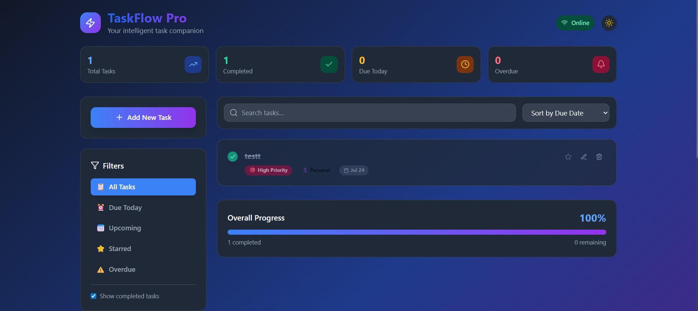

# 🚀 TaskFlow Pro

A modern, intelligent task management application built with **Next.js** and **Firebase** featuring secure user authentication.




## ✨ Features

- 🔐 **User Authentication** (Email/Password, Google, GitHub)
- 🔥 **Real-time synchronization** with Firebase
- 👤 **Personal task spaces** with user isolation
- 🎨 **Modern UI/UX** with Tailwind CSS
- 🌙 **Dark mode** support
- 📱 **Responsive design** for all devices
- ⭐ **Star tasks** for quick access
- 🗂️ **Categories** and **priority levels**
- 📅 **Due dates** with overdue detection
- 🔍 **Search** and **filter** functionality
- 📊 **Progress tracking** and statistics
- ⚡ **Optimistic updates** for better UX
- 🔒 **Secure** environment variables
- 📧 **Email verification** and password reset

## 🛠️ Tech Stack

- **Framework**: Next.js 14 with App Router
- **Authentication**: Firebase Authentication
- **Database**: Firebase Realtime Database
- **Styling**: Tailwind CSS
- **Icons**: Lucide React
- **Deployment**: Vercel
- **Language**: TypeScript
- **State Management**: React Context API

## 📋 Database Schema

### Firebase Realtime Database Structure

```json
{
  "users": {
    "$userId": {
      "email": "user@example.com",
      "displayName": "John Doe",
      "photoURL": "https://...",
      "createdAt": "2024-01-01T00:00:00.000Z",
      "lastLoginAt": "2024-01-01T00:00:00.000Z",
      "preferences": {
        "theme": "dark",
        "notifications": true,
        "defaultCategory": "work"
      }
    }
  },
  "tasks": {
    "$userId": {
      "$taskId": {
        "id": "task-uuid",
        "title": "Complete project documentation",
        "description": "Write comprehensive docs for the new feature",
        "completed": false,
        "starred": true,
        "category": "work",
        "priority": "high",
        "dueDate": "2024-12-31T23:59:59.000Z",
        "createdAt": "2024-01-01T00:00:00.000Z",
        "updatedAt": "2024-01-01T00:00:00.000Z",
        "userId": "$userId"
      }
    }
  },
  "categories": {
    "$userId": {
      "$categoryId": {
        "id": "category-uuid",
        "name": "Work Projects",
        "color": "#3B82F6",
        "icon": "briefcase",
        "taskCount": 5,
        "createdAt": "2024-01-01T00:00:00.000Z"
      }
    }
  }
}
```


## 🚀 Quick Start

### Prerequisites

- Node.js 18+ 
- npm 8+ or yarn
- Firebase account
- Git

### Installation

1. **Clone the repository**
```bash
git clone https://github.com/yourusername/taskflow-pro.git
cd taskflow-pro
```

2. **Install dependencies**
```bash
npm install
# or
yarn install
```

3. **Environment setup**
```bash
# Copy environment template
cp .env.example .env.local

# Edit .env.local with your Firebase credentials
```

4. **Run development server**
```bash
npm run dev
# or
yarn dev
```

5. **Open your browser**
Navigate to [http://localhost:3000](http://localhost:3000)

## 🔐 Firebase Authentication Setup

### Step 1: Create Firebase Project

1. Go to [Firebase Console](https://console.firebase.google.com)
2. Click "Create a project"
3. Enter project name: `taskflow-pro`
4. Enable Google Analytics (optional)
5. Create project

### Step 2: Enable Authentication

1. In Firebase Console, go to **Authentication**
2. Click **Get started**
3. Go to **Sign-in method** tab
4. Enable the following providers:

#### Email/Password Authentication
- Click **Email/Password**
- Enable **Email/Password**
- Enable **Email link (passwordless sign-in)** (optional)
- Save

#### Google Authentication
- Click **Google**
- Enable Google sign-in
- Add your email as test user
- Download config file if needed
- Save

#### GitHub Authentication (Optional)
- Go to GitHub → Settings → Developer settings → OAuth Apps
- Create new OAuth App:
  - Application name: `TaskFlow Pro`
  - Homepage URL: `http://localhost:3000`
  - Authorization callback URL: `https://taskflow-pro.firebaseapp.com/__/auth/handler`
- Copy Client ID and Client Secret
- In Firebase, click **GitHub**
- Enable and paste Client ID and Secret
- Save

### Step 3: Configure Realtime Database

1. Go to **Realtime Database**
2. Click **Create Database**
3. Choose location (preferably closest to your users)
4. Start in **test mode** (we'll secure it later)

### Step 4: Set Security Rules

Replace the default rules with these secure rules:

```json
{
  "rules": {
    "users": {
      "$userId": {
        ".read": "$userId === auth.uid",
        ".write": "$userId === auth.uid"
      }
    },
    "tasks": {
      "$userId": {
        ".read": "$userId === auth.uid",
        ".write": "$userId === auth.uid",
        "$taskId": {
          ".validate": "newData.hasChildren(['title', 'completed', 'createdAt', 'userId']) && newData.child('userId').val() === auth.uid"
        }
      }
    },
    "categories": {
      "$userId": {
        ".read": "$userId === auth.uid",
        ".write": "$userId === auth.uid",
        "$categoryId": {
          ".validate": "newData.hasChildren(['name', 'createdAt']) && newData.child('userId').val() === auth.uid"
        }
      }
    }
  }
}
```

### Step 5: Get Firebase Configuration

1. Go to **Project Settings** (gear icon)
2. Scroll to **Your apps**
3. Click **Web app** icon (`</>`)
4. Register app name: `TaskFlow Pro`
5. Copy the configuration object

### Step 6: Environment Variables

Create `.env.local` with your Firebase config:

```env
# Firebase Configuration
NEXT_PUBLIC_FIREBASE_API_KEY=your_api_key_here
NEXT_PUBLIC_FIREBASE_AUTH_DOMAIN=your_project.firebaseapp.com
NEXT_PUBLIC_FIREBASE_DATABASE_URL=https://your_project-default-rtdb.firebaseio.com/
NEXT_PUBLIC_FIREBASE_PROJECT_ID=your_project_id
NEXT_PUBLIC_FIREBASE_STORAGE_BUCKET=your_project.appspot.com
NEXT_PUBLIC_FIREBASE_MESSAGING_SENDER_ID=your_sender_id
NEXT_PUBLIC_FIREBASE_APP_ID=your_app_id
NEXT_PUBLIC_FIREBASE_MEASUREMENT_ID=your_measurement_id

# App Configuration
NEXTAUTH_URL=http://localhost:3000
NEXTAUTH_SECRET=your_random_secret_key_here
```

### Step 7: Firebase Configuration File

Create `lib/firebase-config.js`:

```javascript
import { initializeApp, getApps } from 'firebase/app';
import { getAuth } from 'firebase/auth';
import { getDatabase } from 'firebase/database';

const firebaseConfig = {
  apiKey: process.env.NEXT_PUBLIC_FIREBASE_API_KEY,
  authDomain: process.env.NEXT_PUBLIC_FIREBASE_AUTH_DOMAIN,
  databaseURL: process.env.NEXT_PUBLIC_FIREBASE_DATABASE_URL,
  projectId: process.env.NEXT_PUBLIC_FIREBASE_PROJECT_ID,
  storageBucket: process.env.NEXT_PUBLIC_FIREBASE_STORAGE_BUCKET,
  messagingSenderId: process.env.NEXT_PUBLIC_FIREBASE_MESSAGING_SENDER_ID,
  appId: process.env.NEXT_PUBLIC_FIREBASE_APP_ID,
  measurementId: process.env.NEXT_PUBLIC_FIREBASE_MEASUREMENT_ID
};

// Initialize Firebase
const app = getApps().length === 0 ? initializeApp(firebaseConfig) : getApps()[0];

// Initialize services
export const auth = getAuth(app);
export const database = getDatabase(app);
export default app;
```

### Step 8: Authentication Context

Create `contexts/AuthContext.js`:

```javascript
'use client';

import { createContext, useContext, useEffect, useState } from 'react';
import {
  signInWithEmailAndPassword,
  createUserWithEmailAndPassword,
  signOut,
  onAuthStateChanged,
  GoogleAuthProvider,
  signInWithPopup,
  sendPasswordResetEmail,
  updateProfile
} from 'firebase/auth';
import { ref, set, get } from 'firebase/database';
import { auth, database } from '../lib/firebase-config';

const AuthContext = createContext({});

export const useAuth = () => useContext(AuthContext);

export const AuthProvider = ({ children }) => {
  const [user, setUser] = useState(null);
  const [loading, setLoading] = useState(true);

  // Sign up with email and password
  const signup = async (email, password, displayName) => {
    const { user } = await createUserWithEmailAndPassword(auth, email, password);
    
    // Update profile with display name
    await updateProfile(user, { displayName });
    
    // Save user data to database
    await set(ref(database, `users/${user.uid}`), {
      email: user.email,
      displayName,
      createdAt: new Date().toISOString(),
      lastLoginAt: new Date().toISOString(),
      preferences: {
        theme: 'light',
        notifications: true,
        defaultCategory: 'personal'
      }
    });

    return user;
  };

  // Sign in with email and password
  const login = async (email, password) => {
    const { user } = await signInWithEmailAndPassword(auth, email, password);
    
    // Update last login
    await set(ref(database, `users/${user.uid}/lastLoginAt`), new Date().toISOString());
    
    return user;
  };

  // Sign in with Google
  const loginWithGoogle = async () => {
    const provider = new GoogleAuthProvider();
    const { user } = await signInWithPopup(auth, provider);
    
    // Check if user exists in database
    const userRef = ref(database, `users/${user.uid}`);
    const snapshot = await get(userRef);
    
    if (!snapshot.exists()) {
      // New user, save to database
      await set(userRef, {
        email: user.email,
        displayName: user.displayName,
        photoURL: user.photoURL,
        createdAt: new Date().toISOString(),
        lastLoginAt: new Date().toISOString(),
        preferences: {
          theme: 'light',
          notifications: true,
          defaultCategory: 'personal'
        }
      });
    } else {
      // Existing user, update last login
      await set(ref(database, `users/${user.uid}/lastLoginAt`), new Date().toISOString());
    }

    return user;
  };

  // Sign out
  const logout = () => signOut(auth);

  // Reset password
  const resetPassword = (email) => sendPasswordResetEmail(auth, email);

  // Monitor auth state
  useEffect(() => {
    const unsubscribe = onAuthStateChanged(auth, (user) => {
      setUser(user);
      setLoading(false);
    });

    return unsubscribe;
  }, []);

  const value = {
    user,
    signup,
    login,
    loginWithGoogle,
    logout,
    resetPassword,
    loading
  };

  return (
    <AuthContext.Provider value={value}>
      {!loading && children}
    </AuthContext.Provider>
  );
};
```

### Step 9: Protected Route Component

Create `components/ProtectedRoute.js`:

```javascript
'use client';

import { useAuth } from '../contexts/AuthContext';
import { useRouter } from 'next/navigation';
import { useEffect } from 'react';

const ProtectedRoute = ({ children }) => {
  const { user, loading } = useAuth();
  const router = useRouter();

  useEffect(() => {
    if (!loading && !user) {
      router.push('/auth/login');
    }
  }, [user, loading, router]);

  if (loading) {
    return (
      <div className="min-h-screen flex items-center justify-center">
        <div className="animate-spin rounded-full h-8 w-8 border-b-2 border-blue-600"></div>
      </div>
    );
  }

  if (!user) {
    return null;
  }

  return children;
};

export default ProtectedRoute;
```

### Step 10: Update App Layout

Update your main layout to include the AuthProvider:

```javascript
// app/layout.js
import { AuthProvider } from '../contexts/AuthContext';
import './globals.css';

export const metadata = {
  title: 'TaskFlow Pro',
  description: 'Modern task management with Firebase',
};

export default function RootLayout({ children }) {
  return (
    <html lang="en">
      <body>
        <AuthProvider>
          {children}
        </AuthProvider>
      </body>
    </html>
  );
}
```

## 📦 Scripts

- `npm run dev` - Start development server
- `npm run build` - Build for production
- `npm run start` - Start production server
- `npm run lint` - Run ESLint
- `npm run type-check` - Run TypeScript checker
- `npm run deploy` - Deploy to Vercel
- `npm run clean` - Clean build files

## 🚀 Deployment

### Deploy to Vercel

[](https://vercel.com/new/clone?repository-url=https://github.com/yourusername/taskflow-pro)

**Manual deployment:**

1. **Install Vercel CLI**
```bash
npm install -g vercel
```

2. **Deploy**
```bash
vercel login
vercel --prod
```

3. **Configure environment variables in Vercel Dashboard**
   - Go to your project settings
   - Add all environment variables from `.env.local`
   - Update `NEXTAUTH_URL` to your production domain

4. **Update Firebase authorized domains**
   - Go to Firebase Console → Authentication → Settings
   - Add your Vercel domain to authorized domains

## 🔒 Security Best Practices

- ✅ Environment variables are properly configured
- ✅ Firebase security rules restrict access to user's own data
- ✅ Authentication required for all sensitive operations
- ✅ Input validation on both client and server
- ✅ HTTPS enforced in production
- ✅ Regular security audits with `npm audit`

## 🧪 Testing

```bash
# Run tests
npm test

# Run tests in watch mode
npm run test:watch

# Run tests with coverage
npm run test:coverage
```

## 📱 Features Overview

### Authentication Features
- 🔐 Email/password registration and login
- 🌐 Social login (Google, GitHub)
- 📧 Email verification
- 🔑 Password reset functionality
- 👤 User profile management
- 🔒 Secure session management

### Task Management
- ✅ Create, edit, delete tasks
- ⭐ Star important tasks
- 📋 Organize by categories
- 🚦 Set priority levels
- 📅 Set due dates with alerts
- 👤 Personal task spaces per user

### User Interface
- 🌙 Dark/Light mode toggle
- 📱 Fully responsive design
- 🔍 Real-time search
- 🗂️ Smart filtering
- 📊 Progress visualization
- ⚡ Smooth animations

## 🤝 Contributing

1. Fork the repository
2. Create your feature branch (`git checkout -b feature/amazing-feature`)
3. Commit your changes (`git commit -m 'Add amazing feature'`)
4. Push to the branch (`git push origin feature/amazing-feature`)
5. Open a Pull Request

### Development Guidelines

- Follow TypeScript best practices
- Write tests for new features
- Follow the existing code style
- Update documentation for API changes
- Ensure security best practices


## 🙏 Acknowledgments

- **Next.js** team for the amazing framework
- **Firebase** for authentication and database services
- **Tailwind CSS** for the utility-first CSS framework
- **Lucide** for the beautiful icons
- **Vercel** for seamless deployment

---

Made with ❤️ by [Nour Islam AOUDIA](https://islamaoudia.me/)

⭐ **Star this repo if it helped you!**